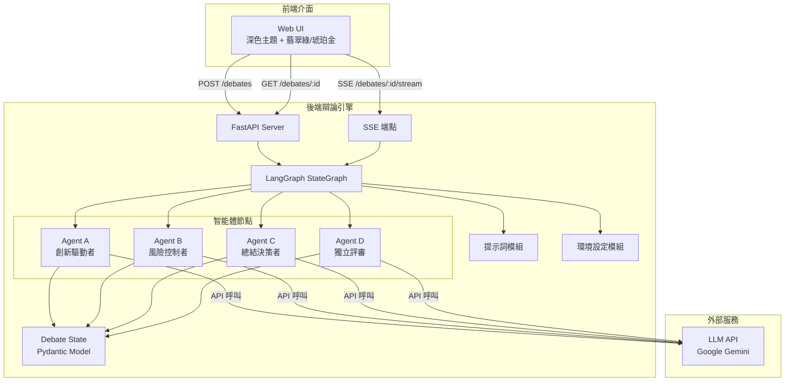
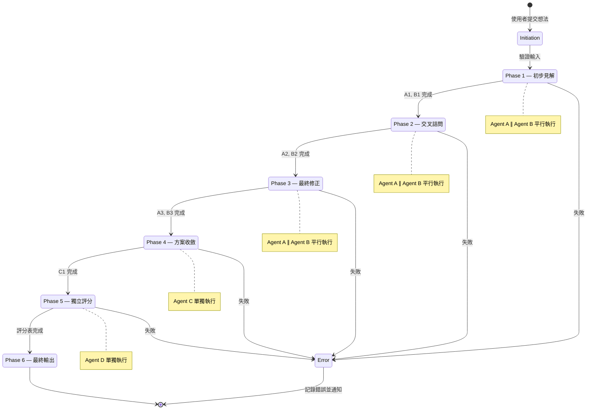

# 技術設計文件：多智能體辯論與決策系統

## 概述

本設計文件描述「多智能體辯論與決策系統」的技術架構與實作細節。系統核心為基於 LangGraph 的辯論引擎，協調四個 AI 智能體（A：創新驅動者、B：風險控制者、C：總結決策者、D：獨立評審）執行六階段結構化辯論流程。前端為深色主題的 Web 應用，透過 SSE 即時呈現辯論進度與結果。

技術棧：
- 後端：Python 3.10+、FastAPI、LangGraph、Pydantic v2、LangChain
- 前端：HTML/CSS/JavaScript（單頁應用）、Chart.js（雷達圖）
- 通訊：Server-Sent Events（SSE）
- 設定管理：python-dotenv、環境變數

## 架構

### 系統架構圖



### 辯論流程狀態機



### 目錄結構

```
multi_agent_system/
├── main.py                  # FastAPI 應用入口
├── .env                     # 環境變數（API 金鑰、模型名稱）
├── config.py                # 環境設定載入與驗證
├── models.py                # Pydantic 資料模型
├── prompts.py               # 四個智能體的系統提示詞
├── agents.py                # 智能體節點函數
├── graph.py                 # LangGraph 狀態機建構
├── api.py                   # FastAPI 路由定義
├── static/
│   └── index.html           # 前端單頁應用（含 CSS/JS）
└── tests/
    ├── test_models.py       # 資料模型測試
    ├── test_agents.py       # 智能體邏輯測試
    ├── test_graph.py        # 狀態機流程測試
    └── test_api.py          # API 端點測試
```


## 元件與介面

### 1. 環境設定模組 (`config.py`)

負責從 `.env` 檔案與環境變數載入所有設定，並在啟動時驗證必要設定是否存在。

```python
class Settings(BaseSettings):
    """系統設定，從環境變數載入"""
    # LLM API 金鑰
    google_api_key: str
    
    # 各智能體使用的模型名稱
    agent_a_model: str = "gemini-3-flash-preview"
    agent_b_model: str = "gemini-3-flash-preview"
    agent_c_model: str = "gemini-3-flash-preview"
    agent_d_model: str = "gemini-3.1-pro-preview"  # 需支援 JSON 輸出
    
    # LLM 呼叫設定
    llm_timeout: int = 120          # 秒
    llm_max_retries: int = 3
    
    model_config = SettingsConfigDict(env_file=".env")

def get_settings() -> Settings:
    """載入並驗證設定，缺少必要設定時拋出明確錯誤"""
```

### 2. 資料模型模組 (`models.py`)

定義辯論流程中所有資料結構，使用 Pydantic v2 進行驗證。

關鍵模型：
- `DebateState`：辯論全局狀態，作為 LangGraph 的 State Schema
- `ScoreCard`：Agent D 的評分表，嚴格 JSON Schema
- `DimensionScore`：單一維度的評分
- `PhaseUpdate`：SSE 推送的階段更新事件

（詳細定義見下方「資料模型」章節）

### 3. 提示詞模組 (`prompts.py`)

集中管理四個智能體的系統提示詞，每個提示詞根據辯論階段動態組合。

```python
def get_agent_a_prompt(phase: int) -> str:
    """取得 Agent A 在指定階段的系統提示詞
    
    Args:
        phase: 辯論階段 (1=初步見解, 2=交叉詰問, 3=最終修正)
    Returns:
        完整的系統提示詞字串
    """

def get_agent_b_prompt(phase: int) -> str:
    """取得 Agent B 在指定階段的系統提示詞"""

def get_agent_c_prompt() -> str:
    """取得 Agent C 的系統提示詞（僅 Phase 4 使用）"""

def get_agent_d_prompt() -> str:
    """取得 Agent D 的系統提示詞（僅 Phase 5 使用，含 JSON Schema 要求）"""
```

### 4. 智能體節點模組 (`agents.py`)

實作四個智能體的節點函數，每個函數接收當前 State 並回傳更新後的部分 State。

```python
async def call_llm_with_retry(
    model_name: str,
    system_prompt: str,
    user_message: str,
    max_retries: int = 3,
    timeout: int = 120,
    json_mode: bool = False
) -> str:
    """呼叫 LLM API，含指數退避重試邏輯
    
    Args:
        model_name: 模型名稱
        system_prompt: 系統提示詞
        user_message: 使用者訊息
        max_retries: 最大重試次數
        timeout: 逾時秒數
        json_mode: 是否啟用 JSON 輸出模式
    Returns:
        LLM 回應文字
    Raises:
        LLMCallError: 重試耗盡後仍失敗
    """

async def node_a(state: DebateState) -> dict:
    """Agent A 節點：根據當前階段產出 A1/A2/A3
    
    根據 state.current_phase 決定行為：
    - Phase 1: 接收 user_input，產出 A1
    - Phase 2: 接收 B1，產出 A2
    - Phase 3: 接收 B2，產出 A3
    """

async def node_b(state: DebateState) -> dict:
    """Agent B 節點：根據當前階段產出 B1/B2/B3"""

async def node_c(state: DebateState) -> dict:
    """Agent C 節點：接收 A3 與 B3，產出 C1"""

async def node_d(state: DebateState) -> dict:
    """Agent D 節點：接收所有方案，產出 JSON 評分表
    
    特殊處理：
    - 強制 JSON 輸出模式
    - 使用 ScoreCard Pydantic 模型驗證輸出
    - 驗證失敗時重試（最多 3 次）
    """
```

### 5. 狀態機建構模組 (`graph.py`)

使用 LangGraph 的 StateGraph 建構辯論流程圖。

```python
def build_debate_graph() -> CompiledGraph:
    """建構並編譯辯論流程圖
    
    圖結構：
    - Phase 1-3: node_a 與 node_b 平行執行（使用 LangGraph 的 parallel branching）
    - Phase 4: node_c 線性執行
    - Phase 5: node_d 線性執行
    - 每個 phase 之間透過 router 函數決定下一步
    
    Returns:
        編譯後的可執行工作流實例
    """

def phase_router(state: DebateState) -> str:
    """根據當前狀態決定下一個執行節點
    
    路由邏輯：
    - Phase 1 完成 → Phase 2 (交叉詰問)
    - Phase 2 完成 → Phase 3 (最終修正)
    - Phase 3 完成 → node_c
    - Phase 4 完成 → node_d
    - Phase 5 完成 → END
    """
```

### 6. API 路由模組 (`api.py`)

FastAPI 路由定義，提供前端所需的所有端點。

```python
@router.post("/debates", response_model=DebateCreateResponse)
async def create_debate(request: DebateCreateRequest) -> DebateCreateResponse:
    """建立新辯論會話
    
    - 驗證輸入非空白
    - 建立 DebateState 並產生唯一 session_id
    - 啟動辯論流程（背景任務）
    - 回傳 session_id
    """

@router.get("/debates/{session_id}", response_model=DebateStatusResponse)
async def get_debate_status(session_id: str) -> DebateStatusResponse:
    """查詢辯論會話狀態
    
    - 回傳當前階段、所有已產出方案、評分表
    - 會話不存在時回傳 404
    """

@router.get("/debates/{session_id}/stream")
async def stream_debate(session_id: str) -> EventSourceResponse:
    """SSE 端點，即時推送辯論進度
    
    事件類型：
    - phase_start: 階段開始
    - phase_complete: 階段完成（含產出摘要）
    - debate_complete: 辯論完成
    - error: 錯誤發生
    """
```

### 7. 前端介面 (`static/index.html`)

單頁應用，包含以下主要元件：

- **輸入區域**：多行文字輸入 + 啟動辯論按鈕
- **辯論時間軸**：六階段進度指示器，含動畫效果
- **方案對比檢視**：三欄並排（A3/B3/C1），可切換單欄模式
- **評分視覺化**：Chart.js 雷達圖 + 評分表格
- **響應式佈局**：桌面三欄、平板/手機單欄堆疊

視覺設計規範：
- 背景：`#0F172A`（深藍黑）
- 卡片背景：`#1E293B`
- 主要強調色：翡翠綠 `#10B981`（Agent A、進度、成功狀態）
- 次要強調色：琥珀金 `#F59E0B`（Agent B、警告、評分高亮）
- Agent C 標記色：`#8B5CF6`（紫羅蘭，僅用於 C 方案標記）
- 文字色：`#F1F5F9`（主要）、`#94A3B8`（次要）
- 禁止使用藍紫漸變作為主視覺


## 資料模型

### 辯論狀態 (`DebateState`)

作為 LangGraph 的 State Schema，貫穿整個辯論流程。

```python
from pydantic import BaseModel, Field
from typing import Optional
from enum import Enum
import uuid

class DebatePhase(str, Enum):
    """辯論階段列舉"""
    INITIATED = "initiated"
    PHASE_1 = "phase_1_initial_insights"
    PHASE_2 = "phase_2_cross_examination"
    PHASE_3 = "phase_3_final_revision"
    PHASE_4 = "phase_4_synthesis"
    PHASE_5 = "phase_5_scoring"
    COMPLETED = "completed"
    FAILED = "failed"

class DebateState(BaseModel):
    """辯論全局狀態"""
    session_id: str = Field(default_factory=lambda: str(uuid.uuid4()))
    user_input: str
    
    # Agent A 回應（Phase 1/2/3）
    a1: Optional[str] = None  # 初步見解
    a2: Optional[str] = None  # 交叉回應
    a3: Optional[str] = None  # 最終修正
    
    # Agent B 回應（Phase 1/2/3）
    b1: Optional[str] = None
    b2: Optional[str] = None
    b3: Optional[str] = None
    
    # Agent C 回應（Phase 4）
    c1: Optional[str] = None  # 折衷方案
    
    # Agent D 回應（Phase 5）
    scores: Optional[ScoreCard] = None
    
    # 流程控制
    current_phase: DebatePhase = DebatePhase.INITIATED
    errors: list[str] = Field(default_factory=list)
```

### 評分表 (`ScoreCard`)

Agent D 的嚴格 JSON 輸出格式。

```python
class DimensionScore(BaseModel):
    """單一維度評分"""
    score: int = Field(ge=1, le=10, description="1-10 整數分數")
    comment: str = Field(description="簡短評語")

class ProposalScore(BaseModel):
    """單一方案的五維度評分"""
    feasibility: DimensionScore       # 可行性
    innovation: DimensionScore        # 創新性
    risk_control: DimensionScore      # 風險控制
    cost_effectiveness: DimensionScore # 成本效益
    overall_recommendation: DimensionScore  # 綜合推薦度

class ScoreCard(BaseModel):
    """完整評分表"""
    a3_score: ProposalScore  # Agent A 最終方案評分
    b3_score: ProposalScore  # Agent B 最終方案評分
    c1_score: ProposalScore  # Agent C 折衷方案評分
    recommended: str = Field(
        pattern="^(a3|b3|c1)$",
        description="綜合推薦度最高的方案標識"
    )
```

### API 請求/回應模型

```python
class DebateCreateRequest(BaseModel):
    """建立辯論請求"""
    user_input: str = Field(min_length=1, description="原始想法文字")
    
    @field_validator("user_input")
    @classmethod
    def validate_not_blank(cls, v: str) -> str:
        if not v.strip():
            raise ValueError("輸入不可為空白")
        return v.strip()

class DebateCreateResponse(BaseModel):
    """建立辯論回應"""
    session_id: str
    status: str = "initiated"

class DebateStatusResponse(BaseModel):
    """辯論狀態查詢回應"""
    session_id: str
    current_phase: DebatePhase
    user_input: str
    a1: Optional[str] = None
    b1: Optional[str] = None
    a2: Optional[str] = None
    b2: Optional[str] = None
    a3: Optional[str] = None
    b3: Optional[str] = None
    c1: Optional[str] = None
    scores: Optional[ScoreCard] = None
    errors: list[str] = []

class PhaseUpdate(BaseModel):
    """SSE 階段更新事件"""
    event_type: str  # phase_start | phase_complete | debate_complete | error
    phase: DebatePhase
    data: Optional[dict] = None
    error_message: Optional[str] = None
```

### 關鍵演算法

#### 指數退避重試

```python
async def call_llm_with_retry(model_name, system_prompt, user_message, 
                                max_retries=3, timeout=120, json_mode=False):
    for attempt in range(max_retries + 1):
        try:
            response = await asyncio.wait_for(
                llm.ainvoke(messages), 
                timeout=timeout
            )
            if json_mode:
                ScoreCard.model_validate_json(response.content)
            return response.content
        except (TimeoutError, ValidationError, APIError) as e:
            if attempt == max_retries:
                raise LLMCallError(f"重試 {max_retries} 次後仍失敗: {e}")
            wait_time = (2 ** attempt) + random.uniform(0, 1)
            await asyncio.sleep(wait_time)
```

#### Phase Router 邏輯

```python
def phase_router(state: DebateState) -> str:
    """根據已填充的欄位決定下一步"""
    if state.current_phase == DebatePhase.PHASE_1:
        return "phase_2_parallel"  # → A2, B2 平行
    elif state.current_phase == DebatePhase.PHASE_2:
        return "phase_3_parallel"  # → A3, B3 平行
    elif state.current_phase == DebatePhase.PHASE_3:
        return "node_c"            # → C1
    elif state.current_phase == DebatePhase.PHASE_4:
        return "node_d"            # → 評分
    elif state.current_phase == DebatePhase.PHASE_5:
        return END
```

#### LangGraph 圖建構

```python
def build_debate_graph():
    graph = StateGraph(DebateState)
    
    # 加入節點
    graph.add_node("node_a", node_a)
    graph.add_node("node_b", node_b)
    graph.add_node("node_c", node_c)
    graph.add_node("node_d", node_d)
    
    # Phase 1-3: A 與 B 平行執行
    # 使用 LangGraph 的 Send API 或 parallel branching
    graph.add_node("parallel_ab", parallel_ab_node)
    
    graph.set_entry_point("parallel_ab")
    graph.add_conditional_edges("parallel_ab", phase_router)
    graph.add_edge("node_c", "node_d")
    graph.add_edge("node_d", END)
    
    return graph.compile()
```


## 正確性屬性（Correctness Properties）

*正確性屬性是一種在系統所有合法執行路徑中都應成立的特徵或行為——本質上是對系統應做之事的形式化陳述。屬性作為人類可讀規格與機器可驗證正確性保證之間的橋樑。*

### Property 1: 會話識別碼唯一性

*For any* 兩個不同的辯論會話建立請求（含有效的非空白輸入），系統產生的會話識別碼（session_id）應互不相同。

**Validates: Requirements 1.1**

### Property 2: 空白輸入拒絕

*For any* 僅由空白字元（空格、Tab、換行等）組成的字串，提交至辯論引擎時應被拒絕，且不應建立任何辯論會話。

**Validates: Requirements 1.3**

### Property 3: 智能體產出寫入狀態

*For any* 智能體（A/B/C/D）的有效回應，寫入辯論狀態後，對應的狀態欄位（a1/b1/a2/b2/a3/b3/c1/scores）應包含該回應內容，且回應必須通過對應的 Pydantic 模型驗證。

**Validates: Requirements 2.4, 3.4, 1.4, 8.2**

### Property 4: 辯論階段單調遞進

*For any* 辯論會話的狀態更新序列，current_phase 的值應嚴格按照 INITIATED → PHASE_1 → PHASE_2 → PHASE_3 → PHASE_4 → PHASE_5 → COMPLETED 的順序遞進（或在任意階段轉為 FAILED），不得跳過或倒退。

**Validates: Requirements 8.4, 10.2**

### Property 5: Phase 3 後辯論循環終止

*For any* 辯論狀態中 a3 與 b3 皆已填充的情況，phase_router 應將流程導向 node_c，而非回到 Agent A 或 Agent B 的節點。

**Validates: Requirements 4.3**

### Property 6: 評分表結構與範圍驗證

*For any* 合法的 ScoreCard 實例，應包含 a3_score、b3_score、c1_score 三個方案評分，每個方案評分應包含可行性、創新性、風險控制、成本效益、綜合推薦度五個維度，且每個維度的分數為 1 至 10 的整數。

**Validates: Requirements 5.2, 5.3**

### Property 7: 評分表 JSON 序列化往返

*For any* 合法的 ScoreCard 實例，將其序列化為 JSON 字串後再反序列化，應產生與原始實例等價的物件。

**Validates: Requirements 5.4**

### Property 8: 指數退避重試行為

*For any* LLM API 呼叫失敗情境，系統應自動重試最多 3 次，每次重試間隔應遵循指數退避策略（2^attempt 秒 + 隨機抖動）。若 3 次重試後仍失敗，系統應將該階段標記為 FAILED 並記錄錯誤資訊。

**Validates: Requirements 5.5, 8.3, 17.1, 17.2**

### Property 9: 推薦方案與最高分一致

*For any* 合法的 ScoreCard 實例，recommended 欄位的值應對應 a3_score、b3_score、c1_score 中 overall_recommendation.score 最高的方案。

**Validates: Requirements 6.4, 14.4, 13.4**

### Property 10: 不存在的會話回傳 404

*For any* 不存在於系統中的會話識別碼字串，查詢該會話的 API 端點應回傳 HTTP 404 狀態碼。

**Validates: Requirements 15.4**

### Property 11: 缺少 API 金鑰時啟動失敗

*For any* 環境變數集合中缺少必要的 API 金鑰（google_api_key），系統設定載入應拋出明確的驗證錯誤，說明缺少哪些設定。

**Validates: Requirements 18.4**


## 錯誤處理

### LLM API 呼叫失敗

| 錯誤類型 | 處理策略 | 重試 | 使用者通知 |
|---------|---------|------|-----------|
| API 逾時（>120s） | 捕獲 `asyncio.TimeoutError`，觸發重試 | 最多 3 次，指數退避 | 階段標記為「進行中（重試）」 |
| API 速率限制（429） | 捕獲 `RateLimitError`，觸發重試 | 最多 3 次，指數退避 | 同上 |
| API 認證失敗（401） | 捕獲 `AuthenticationError`，不重試 | 不重試 | 立即通知，辯論終止 |
| API 伺服器錯誤（5xx） | 捕獲 `APIError`，觸發重試 | 最多 3 次，指數退避 | 階段標記為「進行中（重試）」 |
| 重試耗盡 | 拋出 `LLMCallError` | — | 階段標記為「失敗」，SSE 推送 error 事件 |

### Agent D JSON 驗證失敗

- 使用 `ScoreCard.model_validate_json()` 驗證 Agent D 輸出
- 驗證失敗時，將錯誤訊息附加至下一次 LLM 呼叫的 prompt 中，引導模型修正輸出
- 最多重試 3 次（與 LLM API 重試共用計數器）
- 3 次後仍失敗：記錄原始輸出與驗證錯誤至 `state.errors`，階段標記為 FAILED

### 輸入驗證錯誤

- 空白輸入：Pydantic `field_validator` 攔截，回傳 HTTP 422 + 明確錯誤訊息
- 不存在的 session_id：回傳 HTTP 404 + `{"detail": "會話不存在"}`

### SSE 連線錯誤

- 前端連線中斷：後端辯論流程不受影響，繼續執行
- 前端重新連線：透過 GET 端點取得當前完整狀態，重建 UI

### 啟動時設定錯誤

- 缺少必要環境變數：`Settings` 初始化時拋出 `ValidationError`，程式拒絕啟動
- 錯誤訊息明確列出缺少的設定項目名稱

## 測試策略

### 測試框架

- 單元測試：`pytest` + `pytest-asyncio`
- 屬性測試：`hypothesis`（Python 屬性測試函式庫）
- API 測試：`httpx`（FastAPI TestClient）
- Mock：`unittest.mock` / `pytest-mock`

### 屬性測試（Property-Based Testing）

每個正確性屬性對應一個屬性測試，使用 Hypothesis 函式庫實作。每個測試至少執行 100 次迭代。

| 屬性 | 測試檔案 | 生成器策略 |
|------|---------|-----------|
| Property 1: 會話識別碼唯一性 | `test_models.py` | 生成隨機非空白字串對 |
| Property 2: 空白輸入拒絕 | `test_models.py` | 生成僅含空白字元的字串（`st.text(alphabet=st.sampled_from(' \t\n\r'))`） |
| Property 3: 智能體產出寫入狀態 | `test_agents.py` | 生成隨機 DebateState + 隨機回應字串 |
| Property 4: 辯論階段單調遞進 | `test_graph.py` | 生成隨機階段轉換序列 |
| Property 5: Phase 3 後循環終止 | `test_graph.py` | 生成已填充 a3/b3 的隨機 DebateState |
| Property 6: 評分表結構與範圍 | `test_models.py` | 生成隨機 ScoreCard（分數 1-10，隨機評語） |
| Property 7: 評分表 JSON 往返 | `test_models.py` | 生成隨機 ScoreCard，序列化後反序列化比對 |
| Property 8: 指數退避重試 | `test_agents.py` | 生成隨機失敗次數（0-5），mock LLM 回應 |
| Property 9: 推薦方案與最高分一致 | `test_models.py` | 生成隨機 ScoreCard，驗證 recommended 欄位 |
| Property 10: 不存在的會話 404 | `test_api.py` | 生成隨機 UUID 字串 |
| Property 11: 缺少 API 金鑰啟動失敗 | `test_models.py` | 生成缺少 google_api_key 的環境變數集合 |

每個屬性測試須以註解標記對應的設計屬性：
```python
# Feature: multi-agent-debate-system, Property 7: 評分表 JSON 序列化往返
@given(score_card=score_card_strategy())
@settings(max_examples=100)
def test_scorecard_json_roundtrip(score_card):
    json_str = score_card.model_dump_json()
    restored = ScoreCard.model_validate_json(json_str)
    assert restored == score_card
```

### 單元測試

單元測試聚焦於具體範例、邊界案例與整合點：

- **資料模型測試**（`test_models.py`）：
  - DebateState 包含所有必要欄位（需求 8.1）
  - ScoreCard 拒絕超出範圍的分數（邊界案例）
  - DebateCreateRequest 拒絕空字串（需求 1.3 具體範例）

- **智能體測試**（`test_agents.py`）：
  - 各階段提示詞包含正確的角色關鍵字（需求 9.1-9.4）
  - node_d 在 JSON 驗證失敗時觸發重試（需求 5.5 具體範例）
  - LLM 呼叫逾時設定為 120 秒（需求 17.4）

- **狀態機測試**（`test_graph.py`）：
  - 圖包含 4 個預期節點（需求 10.1）
  - 圖可成功編譯（需求 10.4）
  - 完整辯論流程的 mock 端到端測試

- **API 測試**（`test_api.py`）：
  - POST /debates 建立會話（需求 15.1）
  - GET /debates/:id 查詢狀態（需求 15.2）
  - SSE 端點推送事件格式正確（需求 12.4, 15.3）
  - 重試三次失敗後回報錯誤（需求 5.6）

### 測試原則

- 屬性測試與單元測試互補：屬性測試覆蓋廣泛輸入空間，單元測試驗證具體場景
- 避免過多單元測試——屬性測試已涵蓋大量輸入組合
- 所有 LLM 呼叫在測試中使用 mock，不實際呼叫外部 API
- 每個屬性測試必須由單一 `@given` 裝飾的測試函數實作
