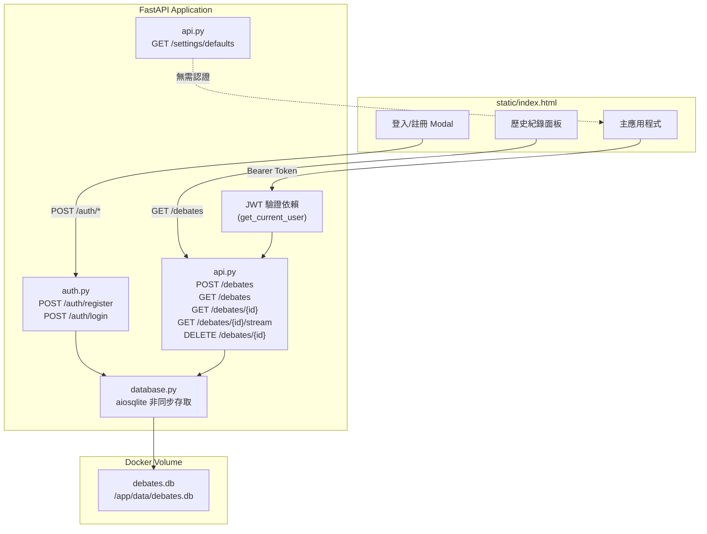
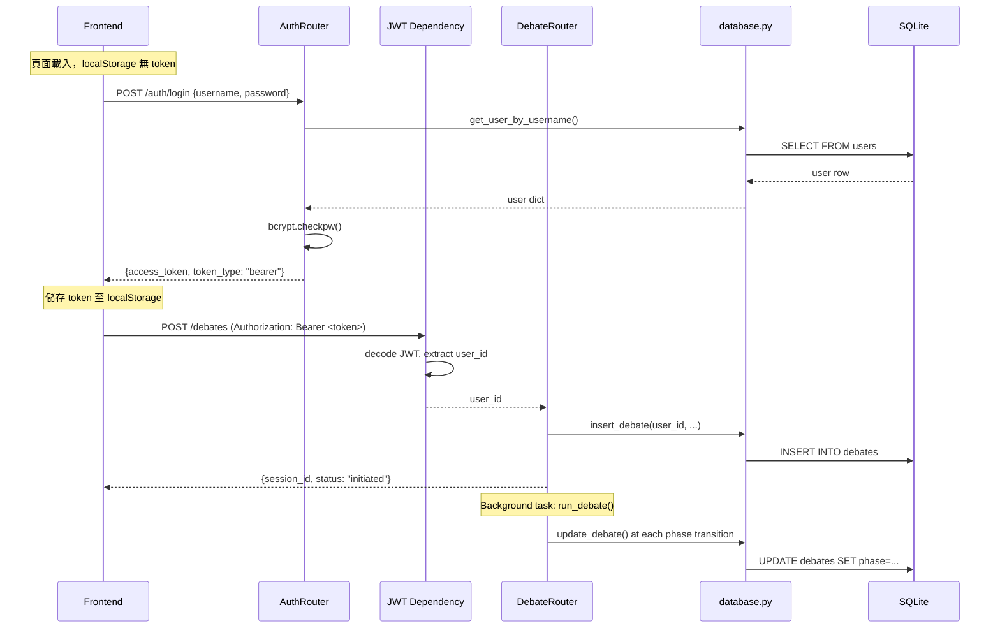

# Design Document: SQLite Auth Persistence

## Overview

本設計為現有多智能體辯論系統新增兩項核心能力：

1. **SQLite 持久化**：以 aiosqlite 取代記憶體內 `dict` 儲存辯論狀態，使資料在伺服器重啟後保留。透過 Docker volume mount 確保容器重建後資料不遺失。
2. **使用者認證**：新增 JWT + bcrypt 認證機制，讓多位使用者各自管理自己的辯論歷史。前端同步新增登入/註冊介面與歷史紀錄面板。

### 設計原則

- 最小化對現有程式碼的修改，新功能以新模組（`database.py`、`auth.py`）封裝
- 辯論流程（SSE 串流、Pipeline、評分）維持完全相容
- 活躍辯論仍使用記憶體內 `DebateState` dict 驅動 SSE，每個 phase transition 同步寫入 SQLite
- 前端維持單一 `index.html`，所有 UI 文字繁體中文，不使用 emoji，深色主題一致

## Architecture

### 系統架構圖



### 請求流程



### 檔案變更總覽

| 檔案 | 動作 | 說明 |
|------|------|------|
| `database.py` | 新增 | aiosqlite 資料庫初始化、CRUD 操作 |
| `auth.py` | 新增 | 註冊、登入、JWT 簽發與驗證 |
| `config.py` | 修改 | 新增 `DATABASE_PATH`、`JWT_SECRET`、`JWT_EXPIRE_HOURS` 設定 |
| `models.py` | 修改 | 新增認證相關 Pydantic models、分頁回應模型 |
| `api.py` | 修改 | 加入 JWT 依賴、新增 `GET /debates`、`DELETE /debates/{id}`、持久化邏輯 |
| `main.py` | 修改 | lifespan 中初始化資料庫 |
| `static/index.html` | 修改 | 新增登入/註冊 Modal、歷史面板、JWT 管理、登出按鈕 |
| `Dockerfile` | 修改 | 建立 `/app/data` 目錄 |
| `docker-compose.yml` | 修改 | 新增 volume mount `./data:/app/data` |
| `requirements.txt` | 修改 | 新增 `aiosqlite`、`bcrypt`、`PyJWT` |


## Components and Interfaces

### 1. `database.py` — 資料庫存取層

負責 SQLite 連線管理、資料表建立、所有 CRUD 操作。使用 aiosqlite 進行非同步存取。

```python
# database.py 公開介面

async def init_db() -> None:
    """建立資料庫檔案與資料表（若不存在）。
    由 main.py lifespan 呼叫。建立 /app/data 目錄（若不存在）。
    建立 users 與 debates 資料表（IF NOT EXISTS）。"""

async def get_db() -> AsyncGenerator[aiosqlite.Connection, None]:
    """FastAPI 依賴注入用的 async generator，yield 一個 connection。"""

# --- Users ---
async def create_user(db: aiosqlite.Connection, username: str, password_hash: str) -> int:
    """插入新使用者，回傳 user id。username 重複時拋出 IntegrityError。"""

async def get_user_by_username(db: aiosqlite.Connection, username: str) -> dict | None:
    """依 username 查詢使用者，回傳 {id, username, password_hash, created_at} 或 None。"""

# --- Debates ---
async def insert_debate(db: aiosqlite.Connection, session_id: str, user_id: int,
                        user_input: str, config_json: str) -> None:
    """插入新辯論紀錄，phase='initiated'，a_responses/b_responses 為空 JSON 陣列。"""

async def update_debate(db: aiosqlite.Connection, session_id: str, **kwargs) -> None:
    """更新辯論紀錄的任意欄位（a_responses, b_responses, c1, scores, phase, updated_at）。"""

async def get_debate(db: aiosqlite.Connection, session_id: str) -> dict | None:
    """依 session_id 查詢單筆辯論，回傳完整 row dict 或 None。"""

async def list_debates(db: aiosqlite.Connection, user_id: int,
                       page: int, page_size: int) -> tuple[list[dict], int]:
    """分頁查詢使用者的辯論列表，回傳 (items, total_count)。
    items 包含 session_id, user_input (前50字), phase, created_at, updated_at。
    依 created_at DESC 排序。"""

async def delete_debate(db: aiosqlite.Connection, session_id: str) -> None:
    """刪除指定辯論紀錄。"""
```

### 2. `auth.py` — 認證模組

負責使用者註冊、登入、JWT 簽發與驗證。

```python
# auth.py 公開介面

auth_router = APIRouter(prefix="/auth", tags=["auth"])

@auth_router.post("/register", status_code=201)
async def register(request: RegisterRequest, db=Depends(get_db)) -> RegisterResponse:
    """註冊新使用者。密碼以 bcrypt 雜湊儲存。
    成功回傳 201 + {username, message}。
    username 重複回傳 409。驗證失敗回傳 422。"""

@auth_router.post("/login")
async def login(request: LoginRequest, db=Depends(get_db)) -> TokenResponse:
    """驗證帳密，成功回傳 {access_token, token_type: "bearer"}。
    失敗回傳 401。"""

def create_access_token(user_id: int, username: str) -> str:
    """簽發 JWT，payload 含 sub=user_id, username, exp=24h。使用 HS256。"""

async def get_current_user(
    authorization: str = Header(...),
    db=Depends(get_db)
) -> dict:
    """FastAPI 依賴：從 Authorization header 解析 JWT，
    回傳 {id, username}。無效/過期 token 拋出 HTTPException(401)。"""
```

### 3. `config.py` — 新增設定欄位

```python
class Settings(BaseSettings):
    # ... 現有欄位 ...

    # 新增
    database_path: str = "/app/data/debates.db"
    jwt_secret: str  # 必填，無預設值
    jwt_expire_hours: int = 24
```

### 4. `models.py` — 新增資料模型

```python
# 認證相關
class RegisterRequest(BaseModel):
    username: str = Field(min_length=3, max_length=32)
    password: str = Field(min_length=6)

class RegisterResponse(BaseModel):
    username: str
    message: str

class LoginRequest(BaseModel):
    username: str
    password: str

class TokenResponse(BaseModel):
    access_token: str
    token_type: str = "bearer"

# 分頁相關
class DebateListItem(BaseModel):
    session_id: str
    user_input: str  # 前 50 字
    phase: str
    created_at: str
    updated_at: str

class PaginatedDebateList(BaseModel):
    items: list[DebateListItem]
    total: int
    page: int
    page_size: int
    total_pages: int
```

### 5. `api.py` — 路由修改

```python
# 修改現有端點，加入 JWT 依賴
@router.post("/debates")
async def create_debate(
    request: DebateCreateRequest,
    background_tasks: BackgroundTasks,
    user: dict = Depends(get_current_user),  # 新增
    db = Depends(get_db),                     # 新增
):
    # 建立 DebateState（同現有邏輯）
    # 新增：insert_debate(db, session_id, user["id"], ...)
    # background task 中每個 phase transition 呼叫 update_debate()

@router.get("/debates/{session_id}")
async def get_debate_status(
    session_id: str,
    user: dict = Depends(get_current_user),  # 新增
    db = Depends(get_db),                     # 新增
):
    # 先查記憶體 dict（活躍辯論），再查 DB（歷史辯論）
    # 驗證 user_id 所有權

@router.get("/debates/{session_id}/stream")
async def stream_debate(
    session_id: str,
    user: dict = Depends(get_current_user),  # 新增
):
    # SSE 串流邏輯不變，僅加入認證

# 新增端點
@router.get("/debates")
async def list_debates(
    page: int = Query(default=1, ge=1),
    page_size: int = Query(default=20, ge=1, le=100),
    user: dict = Depends(get_current_user),
    db = Depends(get_db),
) -> PaginatedDebateList:
    # 呼叫 database.list_debates()

@router.delete("/debates/{session_id}")
async def delete_debate(
    session_id: str,
    user: dict = Depends(get_current_user),
    db = Depends(get_db),
):
    # 查詢辯論，驗證所有權（403 if mismatch），刪除

# 不變
@router.get("/settings/defaults")  # 無需認證
```

### 6. `main.py` — 啟動初始化

```python
@asynccontextmanager
async def lifespan(app: FastAPI):
    settings = get_settings()
    await init_db()  # 新增：初始化資料庫
    # ... 現有邏輯 ...
    yield
```

### 7. Frontend 變更（`static/index.html`）

新增元件：
- **登入/註冊 Modal**：頁面載入時若 localStorage 無 `token`，顯示全螢幕 Modal，含 username/password 欄位與登入/註冊按鈕
- **登出按鈕**：header 區域新增登出按鈕，點擊後清除 token 並顯示登入 Modal
- **歷史紀錄按鈕**：header 區域新增 HISTORY 按鈕（齒輪按鈕旁）
- **歷史面板**：Modal 或側邊面板，顯示辯論列表（摘要、時間、狀態），支援點擊載入、刪除、分頁

API 呼叫修改：
- 所有 `fetch()` 呼叫加入 `Authorization: Bearer <token>` header
- 任何 401 回應觸發登出流程（清除 token、顯示登入 Modal）


## Data Models

### SQLite Schema

```sql
CREATE TABLE IF NOT EXISTS users (
    id INTEGER PRIMARY KEY AUTOINCREMENT,
    username TEXT UNIQUE NOT NULL,
    password_hash TEXT NOT NULL,
    created_at TEXT NOT NULL DEFAULT (datetime('now'))
);

CREATE TABLE IF NOT EXISTS debates (
    session_id TEXT PRIMARY KEY,
    user_id INTEGER NOT NULL REFERENCES users(id),
    user_input TEXT NOT NULL,
    config TEXT NOT NULL DEFAULT '{}',
    a_responses TEXT NOT NULL DEFAULT '[]',
    b_responses TEXT NOT NULL DEFAULT '[]',
    c1 TEXT,
    scores TEXT,
    phase TEXT NOT NULL DEFAULT 'initiated',
    created_at TEXT NOT NULL DEFAULT (datetime('now')),
    updated_at TEXT NOT NULL DEFAULT (datetime('now'))
);

CREATE INDEX IF NOT EXISTS idx_debates_user_id ON debates(user_id);
CREATE INDEX IF NOT EXISTS idx_debates_created_at ON debates(created_at);
```

### JSON 欄位格式

| 欄位 | JSON 格式 | 範例 |
|------|-----------|------|
| `config` | `DebateConfig.model_dump_json()` | `{"rounds":3,"prompt_a":"","prompt_b":"","prompt_c":"","prompt_d":""}` |
| `a_responses` | `json.dumps(list[str])` | `["A1回應","A2回應","A3回應"]` |
| `b_responses` | `json.dumps(list[str])` | `["B1回應","B2回應","B3回應"]` |
| `scores` | `ScoreCard.model_dump_json()` | `{"a_score":{...},"b_score":{...},...}` |

### JWT Payload 結構

```json
{
  "sub": 1,
  "username": "user1",
  "exp": 1700000000,
  "iat": 1699913600
}
```

### 記憶體與資料庫的雙軌策略

活躍辯論（正在 SSE 串流中）同時存在於：
1. **記憶體 `debates` dict**：驅動 SSE 事件推送，提供即時狀態查詢
2. **SQLite `debates` 表**：每個 phase transition 時同步更新

查詢邏輯優先順序：
1. 先查記憶體 dict（活躍辯論，含最新狀態）
2. 若不在記憶體中，查 SQLite（歷史辯論）

辯論完成或失敗後，記憶體中的 entry 可保留一段時間供 SSE 客戶端最終查詢，但主要資料已持久化至 SQLite。

### Docker Volume 配置

```yaml
# docker-compose.yml
services:
  debate:
    build: .
    ports:
      - "8000:8000"
    env_file:
      - .env
    volumes:
      - ./data:/app/data    # 新增：SQLite 持久化
    restart: unless-stopped
```

```dockerfile
# Dockerfile 新增
RUN mkdir -p /app/data
```


## Correctness Properties

*A property is a characteristic or behavior that should hold true across all valid executions of a system — essentially, a formal statement about what the system should do. Properties serve as the bridge between human-readable specifications and machine-verifiable correctness guarantees.*

### Property 1: Registration creates bcrypt-hashed user

*For any* valid username (3-32 characters) and valid password (6+ characters), calling `POST /auth/register` should return HTTP 201 with the username in the response, and the stored `password_hash` in the database should be a valid bcrypt hash that verifies against the original password.

**Validates: Requirements 3.1, 3.5**

### Property 2: Duplicate username registration is rejected

*For any* username that already exists in the users table, a subsequent registration request with the same username should return HTTP 409 regardless of the password provided.

**Validates: Requirements 3.2**

### Property 3: Invalid registration inputs are rejected

*For any* username shorter than 3 characters or longer than 32 characters, or *for any* password shorter than 6 characters, calling `POST /auth/register` should return HTTP 422 and no user record should be created in the database.

**Validates: Requirements 3.3, 3.4**

### Property 4: Login returns well-formed JWT

*For any* registered user, calling `POST /auth/login` with correct credentials should return HTTP 200 with a JWT that: (a) can be decoded using the configured `JWT_SECRET` with HS256, (b) contains `sub` equal to the user's id and `username` equal to the user's username, and (c) has an `exp` claim approximately 24 hours after `iat`.

**Validates: Requirements 4.1, 4.3, 4.4, 4.5**

### Property 5: Invalid credentials are rejected

*For any* login attempt where the username does not exist or the password does not match the stored hash, `POST /auth/login` should return HTTP 401.

**Validates: Requirements 4.2**

### Property 6: Protected endpoints reject unauthenticated requests

*For any* of the protected endpoints (`POST /debates`, `GET /debates/{session_id}`, `GET /debates/{session_id}/stream`, `GET /debates`, `DELETE /debates/{session_id}`), a request without a valid JWT in the `Authorization: Bearer` header should return HTTP 401.

**Validates: Requirements 5.1**

### Property 7: User data isolation

*For any* two distinct users A and B, debates created by user A should not appear in user B's `GET /debates` list, and user B should not be able to access user A's debates via `GET /debates/{session_id}` or delete them via `DELETE /debates/{session_id}`.

**Validates: Requirements 5.4, 8.3**

### Property 8: Debate creation persists to database

*For any* valid debate creation request from an authenticated user, the system should insert a row into the debates table with the correct `user_id`, `user_input`, `config` (as JSON), empty `a_responses` and `b_responses` arrays (as JSON), `phase` set to `"initiated"`, and non-null timestamps.

**Validates: Requirements 6.1**

### Property 9: Phase transitions persist to database

*For any* debate that progresses through the pipeline, at each phase transition (round complete, synthesis complete, scoring complete), the corresponding database row should reflect the updated `a_responses`, `b_responses`, `c1`, `scores`, and `phase` values.

**Validates: Requirements 6.2, 6.3, 6.4**

### Property 10: Debate list is paginated and ordered

*For any* user with N debates, calling `GET /debates?page=P&page_size=S` should return at most S items ordered by `created_at` descending, with correct pagination metadata: `total` = N, `page` = P, `page_size` = S, `total_pages` = ceil(N/S). Each item should contain `session_id`, `user_input` (truncated to 50 characters), `phase`, `created_at`, and `updated_at`.

**Validates: Requirements 7.1, 7.2, 7.3, 7.4**

### Property 11: Debate deletion removes record

*For any* debate owned by the authenticated user, calling `DELETE /debates/{session_id}` should return HTTP 200 and the debate should no longer exist in the database (subsequent `GET /debates/{session_id}` returns 404).

**Validates: Requirements 8.1, 8.4**

### Property 12: Registration round trip

*For any* valid username and password, registering then logging in with the same credentials should succeed and return a valid JWT that grants access to protected endpoints.

**Validates: Requirements 3.1, 4.1**


## Error Handling

### 認證錯誤

| 情境 | HTTP 狀態碼 | 回應 |
|------|------------|------|
| 註冊 username 重複 | 409 | `{"detail": "使用者名稱已被使用"}` |
| 註冊 username/password 驗證失敗 | 422 | Pydantic 標準驗證錯誤格式 |
| 登入帳密錯誤 | 401 | `{"detail": "帳號或密碼錯誤"}` |
| 缺少 Authorization header | 401 | `{"detail": "未提供認證權杖"}` |
| JWT 過期 | 401 | `{"detail": "認證權杖已過期"}` |
| JWT 簽名無效 | 401 | `{"detail": "認證權杖無效"}` |

### 辯論操作錯誤

| 情境 | HTTP 狀態碼 | 回應 |
|------|------------|------|
| 查詢/串流不存在的辯論 | 404 | `{"detail": "會話不存在"}` |
| 刪除不存在的辯論 | 404 | `{"detail": "會話不存在"}` |
| 刪除他人的辯論 | 403 | `{"detail": "無權限存取此辯論"}` |
| 分頁參數無效 | 422 | Pydantic/FastAPI 標準驗證錯誤格式 |

### 資料庫錯誤

- `init_db()` 失敗（磁碟空間不足、權限問題）：記錄錯誤日誌，應用程式啟動失敗
- 寫入失敗：記錄錯誤日誌，辯論流程繼續（記憶體狀態仍可用），但持久化可能不完整
- 連線池耗盡：使用 aiosqlite 單連線模型，不會發生此問題

### 前端錯誤處理

- 任何 API 回傳 401：清除 localStorage token，顯示登入 Modal
- 網路錯誤：顯示連線中斷 banner（沿用現有機制）
- 註冊/登入失敗：在 Modal 內顯示錯誤訊息，不跳轉

## Testing Strategy

### 測試框架與工具

- **單元測試**：pytest + pytest-asyncio + httpx（AsyncClient）
- **Property-based 測試**：Hypothesis（Python PBT 標準庫）
- **Mock**：unittest.mock（mock LLM 呼叫、mock aiosqlite）
- 每個 property test 至少執行 100 次迭代

### 單元測試範圍

1. **database.py**
   - `init_db()` 建立資料表（schema 驗證）
   - `create_user()` / `get_user_by_username()` CRUD
   - `insert_debate()` / `update_debate()` / `get_debate()` / `list_debates()` / `delete_debate()` CRUD
   - 目錄不存在時自動建立
   - 重複 username 拋出 IntegrityError

2. **auth.py**
   - `create_access_token()` 產生可解碼的 JWT
   - `get_current_user()` 正確解析 / 拒絕無效 token
   - 過期 token 處理
   - 錯誤簽名處理

3. **api.py**
   - 所有受保護端點無 token 回傳 401
   - `GET /settings/defaults` 無需 token
   - `GET /debates` 分頁邏輯
   - `DELETE /debates/{session_id}` 所有權驗證
   - 辯論建立後 DB 有對應紀錄

4. **前端**（手動測試）
   - 登入/註冊 Modal 顯示與互動
   - JWT 自動附加與 401 處理
   - 歷史面板載入、點擊、刪除、分頁

### Property-Based 測試範圍

每個 property test 必須以註解標記對應的設計文件 property：

```python
# Feature: sqlite-auth-persistence, Property 1: Registration creates bcrypt-hashed user
@given(
    username=st.text(min_size=3, max_size=32, alphabet=st.characters(whitelist_categories=("L", "N"))),
    password=st.text(min_size=6, max_size=64)
)
@settings(max_examples=100)
def test_registration_creates_bcrypt_user(username, password):
    ...
```

Property test 對應表：

| Property | 測試重點 | 生成策略 |
|----------|---------|---------|
| 1 | 註冊建立 bcrypt 使用者 | 隨機 username (3-32 字元) + password (6+ 字元) |
| 2 | 重複 username 拒絕 | 隨機 username，註冊兩次 |
| 3 | 無效輸入拒絕 | 隨機短/長 username、短 password |
| 4 | 登入回傳正確 JWT | 隨機使用者註冊後登入 |
| 5 | 錯誤帳密拒絕 | 隨機錯誤 username/password |
| 6 | 受保護端點拒絕無 token | 隨機端點 + 無/錯誤 token |
| 7 | 使用者資料隔離 | 兩個隨機使用者，各自建立辯論 |
| 8 | 辯論建立持久化 | 隨機 user_input + config |
| 9 | Phase transition 持久化 | 模擬辯論流程各階段 |
| 10 | 分頁與排序 | 隨機數量辯論 + 隨機 page/page_size |
| 11 | 刪除移除紀錄 | 隨機辯論建立後刪除 |
| 12 | 註冊登入 round trip | 隨機帳密註冊後登入 |

